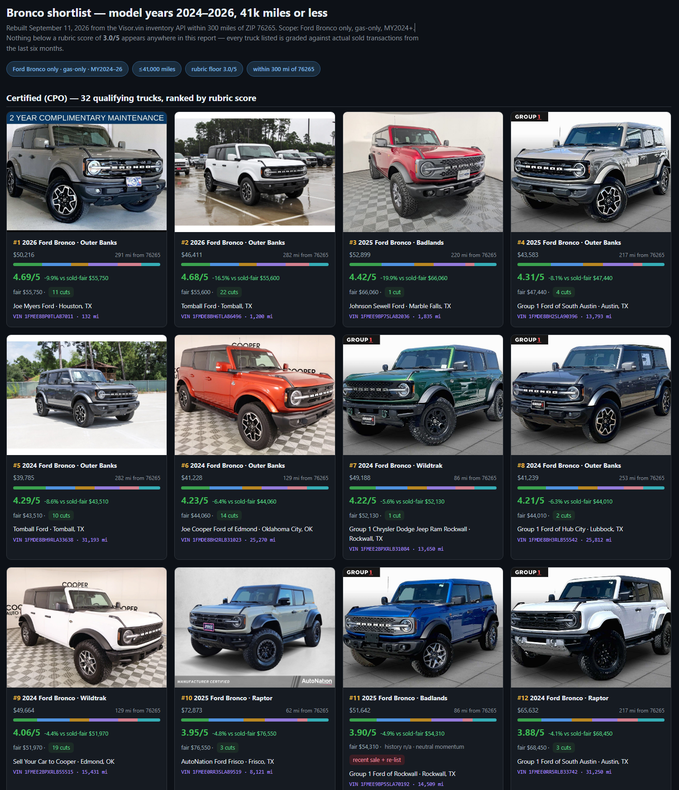

# Hitch — Automobile Buying Assistant (Public Profile)

A [Hermes Agent](https://hermes-agent.nousresearch.com) profile that helps a household
buy the right automobile — not necessarily the flashiest one, but the one that actually
fits how they live. It turns vague “we like that SUV” energy into a clear shortlist,
honest tradeoffs, and a buying plan.



This is a **general-purpose** fork of an internal profile.  All references to any specific
make or model have been removed; you personalize it for your own vehicle below.

## Quick Start

1. Install [Hermes Agent](https://hermes-agent.nousresearch.com).
2. Copy `.env.example` → `.env` and fill in the required values (see **API Keys**).
3. Import this profile:

   ```bash
   hermes profile import ./profiles/hitch-public --name my-car-hunt
   ```
4. Open a chat with `hermes -p my-car-hunt` and ask questions like:
   > “Show me 2024–2025 SUVs under $45k with good reliability.”

## Personalizing for Your Vehicle

The pipeline is generic but **requires you to tell it which automobile you’re shopping**.
Three things control the personalization:

| Setting | Where | What to put | Example |
|---|---|---|---|
| `TARGET_MAKE` / `TARGET_MODEL` / `TARGET_YEARS` | `.env` | The exact make, model, and model years you care about. | `TOYOTA`, `4RUNNER`, `2023-2025` |
| `value-model.json` (copy from `value-model.example.json`) | `./archives/` or a path set by `$HERMES_ARCHIVE_DIR` | A price-regression model: `{ "YEAR|TRIM": {"a": <intercept>, "b": <slope_per_mile>} }`. | `{"2023|Limited": {"a": 46000, "b": -0.08}}` |
| Trim / recall tables in `rubric-score.py` | `automobile-value-rubric/scripts/rubric-score.py` | Replace the example trim lists and expected-mileage / recall tables with values for your vehicle. | — |

> **Tip:** Start by copying every `*.example.json` or `*.example.*` file to its real
> counterpart (without `.example`).  The script will warn you if a required input is missing.

## API Keys

You need exactly one paid endpoint: the Visor.vin inventory API.

| Variable | Required? | Description |
|---|---|---|
| `VISOR_API_KEY` | **Yes** — without this, the report and rubric skills cannot pull live listings or VIN detail. Get a key at [visor.vin](https://visor.vin). | Visor.vin API key (bearer token). |

No other keys are required for the core pipeline.  If you wire in an optional inventory
provider, add its credentials to `.env` and reference them as `${VAR_NAME}` in configs —
never hard-code secrets.

## Pulling Hero Photos (Vehicle Images)

The `automobile-report` skill renders a gallery of vehicle photos alongside each listing.
To pull hero images you need **two things**:

1. **`VISOR_API_KEY`** (already required above) — Visor.vin's listing detail endpoint returns
   an array of photo URLs per VIN under the key `photos`.  These are signed CDN links that
   expire, so they must be fetched at scrape time, not stored long-term.

2. **Local browser automation** (the CDP session described in *Browser Automation Note*).
   The report skill opens each listing's detail page and captures the hero image via a
   headless Chrome/Brave instance on port 9222 — it does NOT hotlink from Visor.vin because:
   - signed URLs expire quickly, breaking saved reports;
   - dealer sites often block cross-origin embeds.

If you prefer to source photos elsewhere (e.g. manufacturer media libraries), set a second
variable in `.env`:

| Variable | Required? | Description |
|---|---|---|
| `PHOTO_PROVIDER` | Optional (`visor-vin` by default) | Set to `autohero`, `carsheet`, or `dealer-api` to switch the photo source. Each requires its own API key — see that provider's docs and add `<PROVIDER>_API_KEY` to `.env`. |

> **Important:** Hero photos are copyrighted material owned by dealers/manufacturers.  They
> must be fetched live at report-build time (the script does this automatically) and should
> not be redistributed or cached beyond the session that consumes them.

## Skills Included

| Skill | Purpose |
|---|---|
| `automobile-report` | Rebuilds a vehicle listing report from live scrapes via the local browser instance (requires Visor.vin API key). |
| `automobile-value-rubric` | Scores active used listings against fair-price comps with a weighted rubric.  Edit `value-model.json` and the trim/recall tables to match your target automobile. |
| `visor-vin-api` | Thin wrapper around the Visor.vin endpoints (listings, VIN lookups, dealer data). |

## Browser Automation Note

The report skill drives a **local browser** via CDP on port 9222 with a dedicated
user-data-dir. If you use Chrome/Brave automation, launch it separately:

```cmd
"C:\Program Files\Google\Chrome\Application\chrome.exe" ^
  --remote-debugging-port=9222 ^
  --user-data-dir="C:/Users/<you>/AppData/Local/hermes/browser-profile-hitch"
```

## License

MIT — see individual skill directories.
